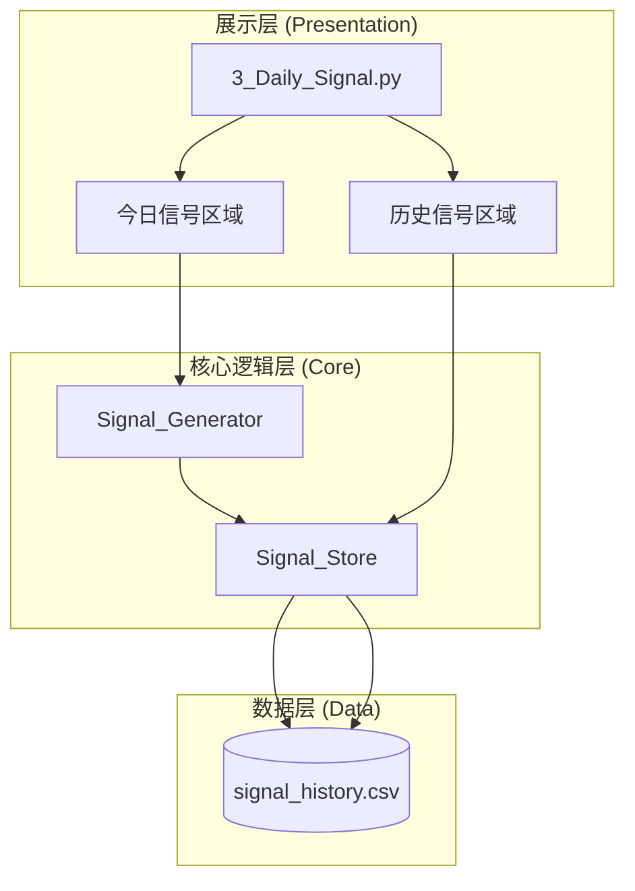

# Design Document: 历史信号模块

## Overview

历史信号模块为 MiniQuant-Lite 系统提供信号持久化和历史查询功能。采用极简设计原则：单文件存储、幂等写入、原生 Streamlit 渲染。

设计原则：
- **单文件存储**: 使用 `data/signal_history.csv` 单一文件，Pandas 读取 2.6 万行仅需 0.01 秒
- **幂等覆盖更新**: 每日多次生成只保留最后一次，避免重复数据
- **原生渲染**: 使用 Streamlit 的 `column_config` 实现颜色和样式，不搞复杂 HTML

## Architecture



### 数据流

```
生成信号流程:
┌─────────────────────────────────────────────────────────┐
│ 用户点击"生成今日信号"                                    │
│         ↓                                               │
│ SignalGenerator.generate_signals()                      │
│         ↓                                               │
│ 展示今日信号                                             │
│         ↓                                               │
│ SignalStore.save_signals(signals, date)                 │
│         ↓                                               │
│ 1. 读取现有 CSV                                          │
│ 2. 删除该日期的旧数据（幂等）                             │
│ 3. 追加新数据                                            │
│ 4. 写回 CSV                                              │
└─────────────────────────────────────────────────────────┘

查询信号流程:
┌─────────────────────────────────────────────────────────┐
│ 用户访问历史信号区域                                      │
│         ↓                                               │
│ SignalStore.load_signals()                              │
│         ↓                                               │
│ 应用筛选条件（日期范围、股票代码、信号类型）               │
│         ↓                                               │
│ 计算统计指标                                             │
│         ↓                                               │
│ st.dataframe() 渲染表格                                  │
└─────────────────────────────────────────────────────────┘
```

## Components and Interfaces

### 1. Signal Store 模块 (`core/signal_store.py`)

负责信号的持久化存储和读取。

```python
from dataclasses import dataclass
from typing import List, Optional
from datetime import date
import pandas as pd
from pathlib import Path

@dataclass
class SignalRecord:
    """历史信号记录"""
    generated_date: date          # 生成日期
    code: str                     # 股票代码
    name: str                     # 股票名称
    signal_type: str              # 信号类型（买入/卖出）
    price_low: float              # 建议价格下限
    price_high: float             # 建议价格上限
    limit_cap: float              # 限价上限
    reason: str                   # 信号依据
    in_report_window: bool        # 是否财报窗口期
    high_fee_warning: bool        # 是否高费率预警
    market_status: str            # 大盘状态（健康/不佳）

class SignalStore:
    """
    信号存储模块
    
    设计原则：
    - 单文件存储，简单粗暴
    - 幂等写入，每日覆盖更新
    """
    
    DEFAULT_PATH = Path("data/signal_history.csv")
    
    # CSV 列定义
    COLUMNS = [
        'generated_date', 'code', 'name', 'signal_type',
        'price_low', 'price_high', 'limit_cap', 'reason',
        'in_report_window', 'high_fee_warning', 'market_status'
    ]
    
    def __init__(self, file_path: Path = None):
        """
        初始化信号存储
        
        Args:
            file_path: CSV 文件路径，默认为 data/signal_history.csv
        """
        self.file_path = file_path or self.DEFAULT_PATH
        self._ensure_file_exists()
    
    def _ensure_file_exists(self) -> None:
        """确保 CSV 文件存在，不存在则创建空文件"""
        if not self.file_path.exists():
            self.file_path.parent.mkdir(parents=True, exist_ok=True)
            pd.DataFrame(columns=self.COLUMNS).to_csv(
                self.file_path, index=False
            )
    
    def save_signals(
        self, 
        signals: List['TradingSignal'], 
        generated_date: date,
        market_status: str = "健康"
    ) -> int:
        """
        保存信号（幂等覆盖更新）
        
        逻辑：
        1. 读取现有数据
        2. 删除该日期的旧数据
        3. 追加新数据
        4. 写回文件
        
        Args:
            signals: 交易信号列表
            generated_date: 生成日期
            market_status: 大盘状态
        
        Returns:
            保存的信号数量
        """
        pass
    
    def load_signals(
        self,
        start_date: Optional[date] = None,
        end_date: Optional[date] = None,
        code: Optional[str] = None,
        signal_type: Optional[str] = None
    ) -> pd.DataFrame:
        """
        加载历史信号
        
        Args:
            start_date: 开始日期（含）
            end_date: 结束日期（含）
            code: 股票代码筛选
            signal_type: 信号类型筛选（买入/卖出）
        
        Returns:
            筛选后的信号 DataFrame
        """
        pass
    
    def get_statistics(self, df: pd.DataFrame) -> dict:
        """
        计算统计指标
        
        Args:
            df: 信号 DataFrame
        
        Returns:
            {
                'total_count': int,      # 总信号数
                'buy_count': int,        # 买入信号数
                'sell_count': int,       # 卖出信号数
                'stock_count': int,      # 涉及股票数
            }
        """
        pass
    
    def export_csv(self, df: pd.DataFrame) -> bytes:
        """
        导出 CSV 数据
        
        Args:
            df: 要导出的 DataFrame
        
        Returns:
            CSV 文件的字节内容
        """
        pass
```

### 2. 历史信号 UI 组件 (`app/pages/3_Daily_Signal.py` 扩展)

在现有的 Daily Signal 页面中添加历史信号区域。

```python
import streamlit as st
import pandas as pd
from datetime import date, timedelta
from core.signal_store import SignalStore

def render_historical_signals():
    """
    渲染历史信号区域
    
    使用 Streamlit 原生组件，不搞复杂 HTML
    """
    st.subheader("📜 历史信号")
    
    signal_store = SignalStore()
    
    # ========== 筛选条件 ==========
    col1, col2, col3 = st.columns(3)
    
    with col1:
        # 日期范围选择
        date_range = st.date_input(
            "日期范围",
            value=(date.today() - timedelta(days=30), date.today()),
            max_value=date.today()
        )
    
    with col2:
        # 股票代码筛选
        code_filter = st.text_input(
            "股票代码",
            placeholder="输入代码筛选，留空显示全部"
        )
    
    with col3:
        # 信号类型筛选
        signal_type_filter = st.selectbox(
            "信号类型",
            options=["全部", "买入", "卖出"]
        )
    
    # ========== 加载数据 ==========
    start_date, end_date = date_range if len(date_range) == 2 else (date_range[0], date_range[0])
    
    df = signal_store.load_signals(
        start_date=start_date,
        end_date=end_date,
        code=code_filter if code_filter else None,
        signal_type=signal_type_filter if signal_type_filter != "全部" else None
    )
    
    # ========== 统计概览 ==========
    if not df.empty:
        stats = signal_store.get_statistics(df)
        
        col1, col2, col3, col4 = st.columns(4)
        with col1:
            st.metric("总信号数", stats['total_count'])
        with col2:
            st.metric("买入信号", stats['buy_count'])
        with col3:
            st.metric("卖出信号", stats['sell_count'])
        with col4:
            st.metric("涉及股票", stats['stock_count'])
        
        st.divider()
        
        # ========== 信号表格 ==========
        render_signal_table(df)
        
        # ========== 导出按钮 ==========
        csv_data = signal_store.export_csv(df)
        st.download_button(
            label="📥 导出 CSV",
            data=csv_data,
            file_name=f"signals_export_{date.today().strftime('%Y%m%d')}.csv",
            mime="text/csv"
        )
    else:
        st.info("📭 暂无历史信号记录")


def render_signal_table(df: pd.DataFrame):
    """
    渲染信号表格
    
    使用 Streamlit 原生 column_config 实现样式
    """
    # 添加显示用的列
    display_df = df.copy()
    
    # 信号类型添加 emoji
    display_df['信号'] = display_df['signal_type'].apply(
        lambda x: f"🟢 {x}" if x == "买入" else f"🔴 {x}"
    )
    
    # 警告标识
    display_df['警告'] = display_df.apply(
        lambda row: "⚠️ 财报" if row['in_report_window'] else (
            "⚠️ 高费率" if row['high_fee_warning'] else ""
        ),
        axis=1
    )
    
    # 选择显示列
    display_columns = [
        'generated_date', 'code', 'name', '信号', 
        'limit_cap', 'reason', '警告'
    ]
    
    st.dataframe(
        display_df[display_columns],
        use_container_width=True,
        hide_index=True,
        column_config={
            'generated_date': st.column_config.DateColumn('日期', format='YYYY-MM-DD'),
            'code': st.column_config.TextColumn('代码'),
            'name': st.column_config.TextColumn('名称'),
            '信号': st.column_config.TextColumn('信号类型'),
            'limit_cap': st.column_config.NumberColumn('限价上限', format='¥%.2f'),
            'reason': st.column_config.TextColumn('信号依据'),
            '警告': st.column_config.TextColumn('警告'),
        }
    )
```

## Data Models

### 信号历史 CSV 格式

| 字段 | 类型 | 说明 |
|------|------|------|
| generated_date | date | 信号生成日期 |
| code | str | 股票代码（6位数字） |
| name | str | 股票名称 |
| signal_type | str | 信号类型（买入/卖出） |
| price_low | float | 建议价格下限 |
| price_high | float | 建议价格上限 |
| limit_cap | float | 限价上限 |
| reason | str | 信号依据 |
| in_report_window | bool | 是否财报窗口期 |
| high_fee_warning | bool | 是否高费率预警 |
| market_status | str | 大盘状态 |

### 示例数据

```csv
generated_date,code,name,signal_type,price_low,price_high,limit_cap,reason,in_report_window,high_fee_warning,market_status
2024-12-20,000001,平安银行,买入,10.50,10.80,10.91,MACD金叉+MA60趋势向上,False,False,健康
2024-12-20,600036,招商银行,买入,35.20,36.00,36.36,MACD金叉+RSI=65,False,False,健康
2024-12-19,000002,万科A,卖出,8.50,8.80,8.89,MACD死叉,False,True,健康
```


## Correctness Properties

*A property is a characteristic or behavior that should hold true across all valid executions of a system—essentially, a formal statement about what the system should do. Properties serve as the bridge between human-readable specifications and machine-verifiable correctness guarantees.*

### Property 1: 保存-读取 Round-Trip

*For any* 有效的交易信号列表和生成日期，调用 `save_signals()` 保存后再调用 `load_signals()` 读取，返回的数据应包含所有保存的信号，且每条信号的所有字段值与原始数据一致。

**Validates: Requirements 1.1, 1.2**

### Property 2: 幂等覆盖更新

*For any* 日期和多次保存操作，对同一日期多次调用 `save_signals()` 后，该日期在 CSV 中只保留最后一次保存的信号数据。即：`load_signals(date, date)` 返回的记录数等于最后一次保存的信号数。

**Validates: Requirements 1.3, 1.5**

### Property 3: 筛选结果正确性

*For any* 筛选条件（日期范围、股票代码、信号类型），`load_signals()` 返回的所有记录都满足指定的筛选条件：
1. 日期在 [start_date, end_date] 范围内
2. 股票代码匹配指定代码（如果指定）
3. 信号类型匹配指定类型（如果指定）

**Validates: Requirements 2.2, 2.3, 2.4**

### Property 4: 统计计算正确性

*For any* 信号 DataFrame，`get_statistics()` 返回的统计结果满足：
1. `total_count` = DataFrame 的行数
2. `buy_count` = signal_type == "买入" 的行数
3. `sell_count` = signal_type == "卖出" 的行数
4. `stock_count` = code 列的唯一值数量

**Validates: Requirements 4.2, 4.3, 4.4**

### Property 5: 导出 Round-Trip

*For any* 信号 DataFrame，调用 `export_csv()` 生成的 CSV 字节内容，解析后应与原始 DataFrame 数据一致（列名和值相同）。

**Validates: Requirements 5.2**

## Error Handling

### 文件操作错误处理

| 错误场景 | 处理方式 |
|---------|---------|
| CSV 文件不存在 | 自动创建空文件并写入表头 |
| 文件读取失败 | 记录错误日志，返回空 DataFrame |
| 文件写入失败 | 抛出异常，由上层捕获并显示错误提示 |
| CSV 格式损坏 | 记录错误日志，尝试跳过损坏行 |

### 数据验证错误处理

| 错误场景 | 处理方式 |
|---------|---------|
| 日期格式无效 | 使用默认日期范围（最近 30 天） |
| 股票代码格式无效 | 忽略筛选条件，返回全部数据 |
| 空信号列表 | 正常处理，不写入任何数据 |

## Testing Strategy

### 测试框架选择

- **单元测试**: pytest
- **属性测试**: hypothesis（Python 属性测试库）

### 单元测试

1. **Signal Store 测试**
   - 测试文件自动创建
   - 测试空信号列表保存
   - 测试日期边界情况

2. **筛选功能测试**
   - 测试单条件筛选
   - 测试多条件组合
   - 测试空结果处理

### 属性测试

属性测试用于验证普遍性质，每个属性测试至少运行 100 次迭代。

测试文件：`tests/test_signal_store_properties.py`

每个属性测试必须包含注释标注：
```python
# Feature: historical-signals, Property N: <property_text>
# Validates: Requirements X.Y
```

### 测试数据生成策略

使用 hypothesis 生成测试数据：

```python
from hypothesis import given, strategies as st
from datetime import date, timedelta

# 股票代码生成器
stock_code = st.from_regex(r'[036][0-9]{5}', fullmatch=True)

# 股票名称生成器
stock_name = st.text(min_size=2, max_size=10, alphabet='中文股票名称')

# 信号类型生成器
signal_type = st.sampled_from(['买入', '卖出'])

# 价格生成器
price = st.floats(min_value=1.0, max_value=500.0, allow_nan=False)

# 日期生成器（最近一年内）
signal_date = st.dates(
    min_value=date.today() - timedelta(days=365),
    max_value=date.today()
)

# 信号记录生成器
@st.composite
def signal_record(draw):
    p_low = draw(price)
    p_high = draw(st.floats(min_value=p_low, max_value=p_low * 1.1))
    return {
        'generated_date': draw(signal_date),
        'code': draw(stock_code),
        'name': draw(stock_name),
        'signal_type': draw(signal_type),
        'price_low': p_low,
        'price_high': p_high,
        'limit_cap': round(p_high * 1.01, 2),
        'reason': 'MACD金叉',
        'in_report_window': draw(st.booleans()),
        'high_fee_warning': draw(st.booleans()),
        'market_status': draw(st.sampled_from(['健康', '不佳']))
    }
```

### 测试目录结构

```
tests/
├── test_signal_store.py           # Signal Store 单元测试
├── test_signal_store_properties.py # Signal Store 属性测试
```
