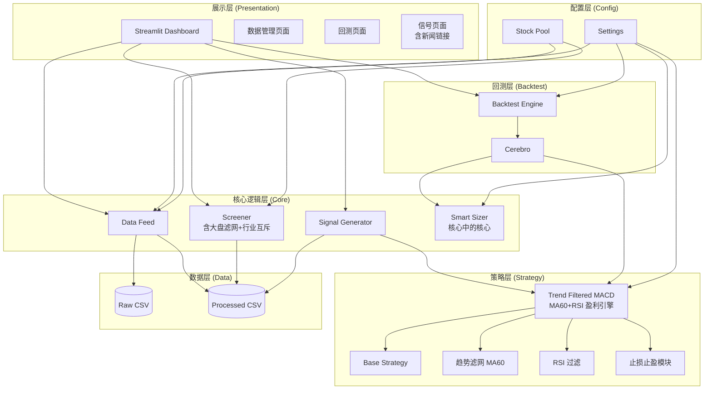
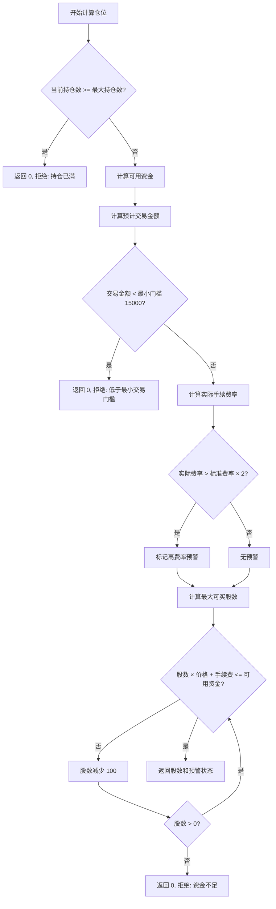

# Design Document: MiniQuant-Lite

## Overview

MiniQuant-Lite 是一套面向 A 股个人投资者的轻量级量化投资辅助系统。系统采用分层架构设计，将数据层、核心逻辑层、策略层、回测层和展示层清晰分离，便于维护和扩展。

技术栈：
- **数据获取**: AkShare（免费开源 A 股数据接口）
- **数据处理**: Pandas
- **回测引擎**: Backtrader
- **可视化界面**: Streamlit
- **日志处理**: Python logging 模块

### 标准作业程序 (SOP)

**推荐运行时间：交易日晚上 19:00 - 21:00**

理由：
1. 此时 AkShare 的日线数据已完全归档（收盘数据通常在 16:30 后稳定）
2. 上市公司当天的盘后公告（利空/利好）基本发布完毕
3. AI Agent 能读取到最完整的新闻信息

**标准操作流程：**
```
晚上 19:00-21:00
    ↓
运行系统生成信号
    ↓
点击新闻链接，人眼扫一遍标题（10秒）
    ↓
将信号放入券商 APP 的"条件单"
    ↓
安心睡觉
    ↓
次日开盘自动执行
```

**注意事项：**
- 避免在交易时段运行，数据可能不完整
- 财报披露季（1月、4月、7月、10月）需格外关注财报窗口期提示
- 重大政策发布日（如两会期间）建议人工复核新闻

## Architecture



### 设计原则：奥卡姆剃刀

本系统遵循"简单即是美"的原则，砍掉所有华而不实的功能：

**已删除的功能：**
- ❌ Webhook 推送（你本人就在屏幕前，Streamlit 直接显示即可）
- ❌ 多线程并发下载（串行下载几十只股票只需几秒，避免复杂的线程安全问题）
- ❌ 复杂的 AI/LLM 分析（用新闻链接替代，人眼看标题只需 10 秒）

**核心保留的功能（赚钱/保命模块）：**
- ✅ Smart Sizer（5% 现金缓冲、5 元低消预警、最大持仓限制）—— 核心中的核心
- ✅ 大盘滤网（沪深300 < MA20 时强制空仓）—— 保命符
- ✅ Trend Strategy（MA60 + RSI）—— 盈利引擎
- ✅ 财报窗口期检测 —— 硬风控
- ✅ SOP 标准作业程序 —— 纪律约束

## Components and Interfaces

### 1. Data Feed 模块 (`core/data_feed.py`)

负责从 AkShare 获取数据并进行清洗转换。

```python
from dataclasses import dataclass
from typing import Optional, List
from datetime import date
import pandas as pd

@dataclass
class StockData:
    """股票数据结构"""
    code: str                    # 股票代码
    name: str                    # 股票名称
    data: pd.DataFrame           # OHLCV 数据
    last_update: date            # 最后更新日期

class DataFeed:
    """数据获取与清洗模块"""
    
    # 推荐的 AkShare 版本（经过测试验证）
    RECOMMENDED_AKSHARE_VERSION = "1.12.0"
    
    def __init__(self, raw_path: str, processed_path: str):
        """
        初始化数据路径
        
        启动时检查 AkShare 版本，如果版本不匹配则发出警告
        """
        self._check_akshare_version()
    
    def _check_akshare_version(self) -> None:
        """
        检查 AkShare 版本
        
        AkShare 依赖爬虫技术，网页源改版可能导致接口失效
        建议锁定版本，除非万不得已不要随意升级
        """
        import akshare as ak
        import logging
        
        logger = logging.getLogger(__name__)
        current_version = ak.__version__
        
        if current_version != self.RECOMMENDED_AKSHARE_VERSION:
            logger.warning(
                f"AkShare 版本不匹配！当前: {current_version}, 推荐: {self.RECOMMENDED_AKSHARE_VERSION}。"
                f"如遇数据获取问题，请尝试: pip install akshare=={self.RECOMMENDED_AKSHARE_VERSION}"
            )
    
    def download_stock_data(
        self, 
        code: str, 
        start_date: str, 
        end_date: str,
        adjust: str = 'qfq'
    ) -> Optional[pd.DataFrame]:
        """
        下载单只股票历史数据（前复权）
        
        Args:
            code: 股票代码（如 '000001'）
            start_date: 开始日期 'YYYY-MM-DD'
            end_date: 结束日期 'YYYY-MM-DD'
            adjust: 复权类型，默认 'qfq'（前复权），消除分红送转影响
        
        Returns:
            DataFrame 或 None（失败时）
        """
        import akshare as ak
        import logging
        
        logger = logging.getLogger(__name__)
        
        try:
            df = ak.stock_zh_a_hist(
                symbol=code,
                period="daily",
                start_date=start_date.replace('-', ''),
                end_date=end_date.replace('-', ''),
                adjust=adjust
            )
            return df
            
        except Exception as e:
            error_msg = str(e)
            
            # 提供详细的错误诊断
            if "Connection" in error_msg or "Timeout" in error_msg:
                logger.error(
                    f"网络连接失败: {code}。请检查网络连接，或稍后重试。"
                )
            elif "KeyError" in error_msg or "AttributeError" in error_msg:
                logger.error(
                    f"数据解析失败: {code}。可能是 AkShare 接口已更新。"
                    f"推荐版本: {self.RECOMMENDED_AKSHARE_VERSION}"
                )
            else:
                logger.error(f"数据下载失败: {code}，错误: {error_msg}")
            
            return None
    
    def download_batch(
        self, 
        codes: List[str], 
        start_date: str, 
        end_date: str,
        adjust: str = 'qfq'
    ) -> dict[str, pd.DataFrame]:
        """
        批量下载股票数据（串行，简单稳定）
        
        设计原则：稳定压倒一切
        - 串行下载几十只股票只需几秒
        - 避免多线程带来的复杂性（死锁、线程安全、IP 封禁）
        
        Args:
            codes: 股票代码列表
            start_date: 开始日期
            end_date: 结束日期
            adjust: 复权类型
        
        Returns:
            {股票代码: DataFrame} 字典
        """
        import logging
        import time
        
        logger = logging.getLogger(__name__)
        results = {}
        
        for i, code in enumerate(codes):
            df = self.download_stock_data(code, start_date, end_date, adjust)
            if df is not None:
                results[code] = df
                logger.info(f"下载完成: {code} ({i+1}/{len(codes)})")
            else:
                logger.warning(f"下载失败: {code}")
            
            # 简单的请求间隔，避免被封 IP
            time.sleep(0.5)
        
        return results
    
    def download_batch(
        self, 
        codes: List[str], 
        start_date: str, 
        end_date: str,
        adjust: str = 'qfq'
    ) -> dict[str, pd.DataFrame]:
        """批量下载股票数据（前复权）"""
        pass
    
    def get_market_snapshot(self, liquidity_filter: 'LiquidityFilter' = None) -> pd.DataFrame:
        """
        获取全市场实时快照并进行预剪枝（性能优化关键）
        
        设计原则：先用实时数据快速过滤，再对候选池下载历史数据
        - 全市场 5000+ 只股票 → 预剪枝后约 100-300 只候选
        - 避免对不符合条件的股票下载历史数据，节省 90%+ 的时间
        
        预剪枝条件（基于实时快照数据）：
        1. 流通市值在 50亿-500亿 之间
        2. 换手率在 2%-15% 之间
        3. 剔除 ST 股票
        4. 剔除上市不满 60 天的新股
        
        Args:
            liquidity_filter: 流动性过滤配置，None 时使用默认值
        
        Returns:
            DataFrame，包含列：code, name, price, market_cap, turnover_rate, listing_date, industry
        """
        import akshare as ak
        import logging
        from datetime import datetime, timedelta
        
        logger = logging.getLogger(__name__)
        
        if liquidity_filter is None:
            liquidity_filter = LiquidityFilter()
        
        try:
            # 获取全市场实时行情快照（单次 API 调用，约 1-2 秒）
            df = ak.stock_zh_a_spot_em()
            
            logger.info(f"获取全市场快照: {len(df)} 只股票")
            
            # 预剪枝 1: 剔除 ST 股票
            if liquidity_filter.exclude_st:
                df = df[~df['名称'].str.contains('ST', na=False)]
                logger.info(f"剔除 ST 后: {len(df)} 只")
            
            # 预剪枝 2: 流通市值过滤
            df = df[
                (df['流通市值'] >= liquidity_filter.min_market_cap) &
                (df['流通市值'] <= liquidity_filter.max_market_cap)
            ]
            logger.info(f"流通市值过滤后: {len(df)} 只")
            
            # 预剪枝 3: 换手率过滤
            df = df[
                (df['换手率'] >= liquidity_filter.min_turnover_rate * 100) &
                (df['换手率'] <= liquidity_filter.max_turnover_rate * 100)
            ]
            logger.info(f"换手率过滤后: {len(df)} 只")
            
            # 预剪枝 4: 上市天数过滤（需要额外查询）
            # 注意：这一步可选，因为会增加 API 调用
            
            # 标准化输出列
            result = df[['代码', '名称', '最新价', '流通市值', '换手率']].copy()
            result.columns = ['code', 'name', 'price', 'market_cap', 'turnover_rate']
            
            logger.info(f"预剪枝完成: {len(result)} 只候选股票")
            return result
            
        except Exception as e:
            logger.error(f"获取市场快照失败: {e}")
            return pd.DataFrame()
    
    def clean_data(self, df: pd.DataFrame) -> pd.DataFrame:
        """
        清洗数据，转换为 Backtrader 格式
        
        输出列: date, open, high, low, close, volume
        注意: 输入数据应为前复权数据
        """
        pass
    
    def overwrite_update(self, code: str, days: int = 365) -> bool:
        """
        覆盖更新数据
        
        采用覆盖策略而非增量更新，以确保复权数据准确性。
        每次更新时覆盖重写最近 N 天的数据。
        
        Args:
            code: 股票代码
            days: 覆盖天数，默认 365 天
        
        Returns:
            是否更新成功
        """
        pass
    
    def load_processed_data(self, code: str) -> Optional[pd.DataFrame]:
        """加载已处理的数据"""
        pass
```

### 2. Screener 模块 (`core/screener.py`)

基于 Pandas 实现选股筛选逻辑，包含流动性过滤。

```python
from dataclasses import dataclass
from typing import List, Optional
import pandas as pd

@dataclass
class ScreenerCondition:
    """筛选条件"""
    indicator: str      # 指标名称（如 'ma5', 'macd', 'rsi'）
    operator: str       # 比较运算符（'>', '<', '>=', '<=', '==', 'between'）
    value: float        # 比较值
    value2: Optional[float] = None  # between 时的第二个值

@dataclass
class LiquidityFilter:
    """流动性过滤配置"""
    min_market_cap: float = 5e9       # 最小流通市值（50亿）
    max_market_cap: float = 5e10      # 最大流通市值（500亿）
    min_turnover_rate: float = 0.02   # 最小换手率（2%）
    max_turnover_rate: float = 0.15   # 最大换手率（15%）
    exclude_st: bool = True           # 剔除 ST 股
    min_listing_days: int = 60        # 最小上市天数

@dataclass
class MarketFilter:
    """大盘滤网配置"""
    enabled: bool = True              # 是否启用大盘滤网
    benchmark_code: str = '000300'    # 基准指数代码（沪深300）
    ma_period: int = 20               # 均线周期
    require_above_ma: bool = True     # 要求指数在均线之上

@dataclass
class IndustryDiversification:
    """行业分散配置"""
    enabled: bool = True              # 是否启用行业互斥
    max_same_industry: int = 1        # 同一行业最多选几只

@dataclass
class ScreenerResult:
    """筛选结果"""
    code: str           # 股票代码
    name: str           # 股票名称
    price: float        # 当前价格
    market_cap: float   # 流通市值
    turnover_rate: float  # 换手率
    ma60_trend: str     # MA60 趋势（上升/下降）
    industry: str       # 所属行业
    indicators: dict    # 关键指标值

class Screener:
    """选股器（含流动性过滤、大盘滤网、行业互斥）"""
    
    def __init__(self, data_feed: 'DataFeed'):
        """初始化，注入数据源"""
        self.market_filter = MarketFilter()
        self.industry_diversification = IndustryDiversification()
        pass
    
    def add_condition(self, condition: ScreenerCondition) -> 'Screener':
        """添加筛选条件，支持链式调用"""
        pass
    
    def set_liquidity_filter(self, filter_config: LiquidityFilter) -> 'Screener':
        """设置流动性过滤配置"""
        pass
    
    def set_market_filter(self, filter_config: MarketFilter) -> 'Screener':
        """设置大盘滤网配置"""
        pass
    
    def set_industry_diversification(self, config: IndustryDiversification) -> 'Screener':
        """设置行业分散配置"""
        pass
    
    def clear_conditions(self) -> None:
        """清空所有条件"""
        pass
    
    def calculate_indicators(self, df: pd.DataFrame) -> pd.DataFrame:
        """
        计算技术指标
        
        支持指标: MA5, MA10, MA20, MA60, MACD, RSI, 成交量均值
        """
        pass
    
    def _check_market_condition(self) -> bool:
        """
        检查大盘环境（沪深300均线滤网）
        
        规则：沪深300指数 > MA20 时，大盘环境健康，允许开仓
        
        Returns:
            True 表示大盘环境健康
        """
        if not self.market_filter.enabled:
            return True
        
        # 获取沪深300指数数据
        # 检查是否在均线之上
        pass
    
    def _check_st_stock(self, name: str) -> bool:
        """
        检查是否为 ST 股票
        
        Args:
            name: 股票名称
        
        Returns:
            True 表示是 ST 股票，应剔除
        """
        return 'ST' in name or '*ST' in name
    
    def _check_listing_days(self, code: str, min_days: int = 60) -> bool:
        """
        检查上市天数是否满足要求
        
        Args:
            code: 股票代码
            min_days: 最小上市天数
        
        Returns:
            True 表示满足要求
        """
        pass
    
    def _check_ma60_trend(self, df: pd.DataFrame) -> bool:
        """
        检查 MA60 趋势是否向上
        
        规则: MA60(今日) > MA60(昨日)
        
        Returns:
            True 表示均线向上，先天胜率高
        """
        if len(df) < 61:
            return False
        ma60_today = df['close'].tail(60).mean()
        ma60_yesterday = df['close'].iloc[-61:-1].mean()
        return ma60_today > ma60_yesterday
    
    def _get_stock_industry(self, code: str) -> str:
        """
        获取股票所属行业
        
        使用 AkShare 获取行业分类
        """
        pass
    
    def _apply_industry_diversification(self, results: List[ScreenerResult]) -> List[ScreenerResult]:
        """
        应用行业互斥逻辑
        
        同一行业最多保留 N 只股票，避免行业集中风险
        
        Args:
            results: 初步筛选结果
        
        Returns:
            行业分散后的结果
        """
        if not self.industry_diversification.enabled:
            return results
        
        industry_count = {}
        diversified_results = []
        
        for result in results:
            industry = result.industry
            current_count = industry_count.get(industry, 0)
            
            if current_count < self.industry_diversification.max_same_industry:
                diversified_results.append(result)
                industry_count[industry] = current_count + 1
        
        return diversified_results
    
    def screen(self, stock_pool: List[str] = None) -> List[ScreenerResult]:
        """
        执行筛选（两阶段优化：预剪枝 + 精筛）
        
        性能优化关键：
        - 第一阶段：用实时快照数据预剪枝（1-2秒，5000只→100-300只）
        - 第二阶段：对候选池下载历史数据并精筛（几十秒）
        - 总耗时从"几十分钟"降到"1分钟内"
        
        筛选流程：
        ┌─────────────────────────────────────────────────────────┐
        │ 第一阶段：预剪枝（基于实时快照，无需下载历史数据）        │
        │ 0. 大盘滤网检查（沪深300 > MA20）                        │
        │ 1. 流通市值过滤（50亿-500亿）                            │
        │ 2. 换手率过滤（2%-15%）                                  │
        │ 3. 剔除 ST 股票                                          │
        │ 4. 剔除上市不满 60 天的新股                              │
        │ → 生成 candidate_pool（约 100-300 只）                   │
        └─────────────────────────────────────────────────────────┘
                                    ↓
        ┌─────────────────────────────────────────────────────────┐
        │ 第二阶段：精筛（对 candidate_pool 下载历史数据）         │
        │ 5. 下载候选池历史数据                                    │
        │ 6. 财报窗口期过滤                                        │
        │ 7. MA60 趋势过滤（均线向上）                             │
        │ 8. 技术指标条件过滤（MACD、RSI 等）                      │
        │ 9. 行业互斥（同行业最多 1 只）                           │
        └─────────────────────────────────────────────────────────┘
        
        Args:
            stock_pool: 股票代码列表（可选，None 时使用全市场预剪枝）
        
        Returns:
            符合条件的股票列表
        """
        import logging
        
        # 0. 大盘滤网检查（最先执行，避免无效计算）
        if not self._check_market_condition():
            logging.warning("大盘环境不佳（沪深300 < MA20），建议空仓观望")
            return []
        
        # ========== 第一阶段：预剪枝 ==========
        if stock_pool is None:
            # 使用全市场快照进行预剪枝
            snapshot = self.data_feed.get_market_snapshot(self.liquidity_filter)
            candidate_pool = snapshot['code'].tolist()
            logging.info(f"预剪枝完成: {len(candidate_pool)} 只候选股票")
        else:
            # 使用指定股票池
            candidate_pool = stock_pool
        
        if not candidate_pool:
            logging.warning("预剪枝后无候选股票")
            return []
        
        # ========== 第二阶段：精筛 ==========
        # 5. 下载候选池历史数据
        historical_data = self.data_feed.download_batch(
            candidate_pool, 
            start_date=self._get_lookback_date(90),  # 需要 60 天 MA + 缓冲
            end_date=self._get_today()
        )
        
        results = []
        for code, df in historical_data.items():
            # 6. 财报窗口期过滤
            if self._check_report_window(code):
                continue
            
            # 7. MA60 趋势过滤
            if not self._check_ma60_trend(df):
                continue
            
            # 8. 技术指标条件过滤
            if not self._check_technical_conditions(df):
                continue
            
            # 构建结果
            result = self._build_screener_result(code, df)
            if result:
                results.append(result)
        
        # 9. 行业互斥
        return self._apply_industry_diversification(results)
```

### 3. Sizer 模块 (`core/sizers.py`)

资金管理与仓位控制，针对小资金特殊优化。

#### Smart Sizer 流程图



```python
import backtrader as bt
from typing import Tuple
from enum import Enum

class SizerMode(Enum):
    """仓位控制模式"""
    MAX_POSITIONS = "max_positions"  # 最大持仓只数模式（推荐小资金使用）
    PERCENT = "percent"              # 百分比模式

class SmallCapitalSizer(bt.Sizer):
    """
    小资金智能仓位管理器
    
    特点：
    - 采用最大持仓只数模式，避免百分比陷阱
    - 确保买入数量为100股整数倍
    - 预留手续费，考虑5元低消问题
    - 支持仓位容差逻辑
    - 最小交易金额门槛检查
    - 强制保留 5% 现金缓冲，防止次日高开废单
    """
    
    params = (
        ('max_positions_count', 2),    # 最大同时持仓只数（替代百分比限制）
        ('position_tolerance', 0.05),  # 仓位容差（允许超限5%）
        ('commission_rate', 0.0003),   # 手续费率
        ('min_commission', 5.0),       # 最低手续费（5元低消）
        ('min_trade_amount', 15000.0), # 最小交易金额门槛，低于此值禁止开仓
        ('cash_buffer', 0.05),         # 现金缓冲比例（5%），防止高开废单
    )
    
    def _getsizing(
        self, 
        comminfo, 
        cash, 
        data, 
        isbuy: bool
    ) -> int:
        """
        计算买入/卖出数量
        
        智能仓位计算流程：
        1. 检查当前持仓数量是否已达上限
        2. 计算可用资金（考虑手续费）
        3. 检查是否满足最小交易金额门槛
        4. 计算最大可买股数（100股整数倍）
        5. 应用仓位容差逻辑
        
        Returns:
            买入股数（100的整数倍）或 0
        """
        pass
    
    def _check_high_fee_warning(self, trade_amount: float) -> bool:
        """
        检查是否触发高费率预警
        
        当交易金额较小时，5元低消会导致实际费率远高于标准费率
        
        Args:
            trade_amount: 交易金额
        
        Returns:
            True 表示触发高费率预警
        """
        pass

def calculate_max_shares(
    cash: float, 
    price: float, 
    commission_rate: float,
    min_commission: float,
    max_positions_count: int,
    current_positions: int,
    total_value: float,
    position_tolerance: float = 0.05,
    min_trade_amount: float = 15000.0,
    cash_buffer: float = 0.05
) -> Tuple[int, bool, str]:
    """
    计算最大可买入股数（智能版）
    
    Args:
        cash: 可用现金
        price: 股票价格
        commission_rate: 手续费率
        min_commission: 最低手续费
        max_positions_count: 最大持仓只数
        current_positions: 当前持仓只数
        total_value: 账户总价值
        position_tolerance: 仓位容差比例
        min_trade_amount: 最小交易金额门槛
        cash_buffer: 现金缓冲比例（默认5%），防止次日高开废单
    
    Returns:
        (可买入股数, 是否高费率预警, 拒绝原因或空字符串)
        - 股数为100的整数倍
        - 高费率预警为 True 时建议谨慎交易
        - 拒绝原因非空时表示不建议交易
    
    拒绝原因示例（让用户死心）：
        - "持仓已满（2/2），请先卖出再买入"
        - "股价过高（¥150），只能买 1 手，低于最小交易门槛，放弃交易"
        - "资金不足，无法买入 100 股"
        - "交易金额 ¥8,000 低于门槛 ¥15,000，手续费磨损过高，放弃交易"
    
    Note:
        现金缓冲逻辑：强制保留 5% 现金，防止因次日高开导致废单
        例如：账户 55000 元，保留 2750 元缓冲，实际可用 52250 元
    """
    import logging
    logger = logging.getLogger(__name__)
    
    # 1. 检查持仓数量
    if current_positions >= max_positions_count:
        reason = f"持仓已满（{current_positions}/{max_positions_count}），请先卖出再买入"
        logger.info(f"拒绝交易: {reason}")
        return 0, False, reason
    
    # 2. 计算实际可用现金（扣除缓冲）
    available_cash = cash * (1 - cash_buffer)
    
    # 3. 计算最大可买股数
    max_shares = int(available_cash / price / 100) * 100
    
    if max_shares == 0:
        reason = f"资金不足（可用 ¥{available_cash:,.0f}），无法买入 100 股（需 ¥{price * 100:,.0f}）"
        logger.info(f"拒绝交易: {reason}")
        return 0, False, reason
    
    # 4. 检查最小交易金额门槛
    trade_amount = max_shares * price
    if trade_amount < min_trade_amount:
        reason = f"交易金额 ¥{trade_amount:,.0f} 低于门槛 ¥{min_trade_amount:,.0f}，手续费磨损过高，放弃交易"
        logger.info(f"拒绝交易: {reason}")
        return 0, False, reason
    
    # 5. 检查高费率预警
    actual_fee = max(min_commission, trade_amount * commission_rate)
    actual_fee_rate = actual_fee / trade_amount
    high_fee_warning = actual_fee_rate > commission_rate * 2
    
    if high_fee_warning:
        logger.warning(f"高费率预警: 实际费率 {actual_fee_rate:.4%} > 标准费率 {commission_rate:.4%} × 2")
    
    return max_shares, high_fee_warning, ""

def calculate_actual_fee_rate(trade_amount: float, commission_rate: float, min_commission: float) -> float:
    """
    计算实际手续费率
    
    考虑5元低消的影响，小金额交易实际费率可能远高于标准费率
    
    Args:
        trade_amount: 交易金额
        commission_rate: 标准手续费率
        min_commission: 最低手续费
    
    Returns:
        实际手续费率
    """
    pass
```

### 4. Strategy 模块 (`strategies/`)

#### 4.1 策略基类 (`base_strategy.py`)

```python
import backtrader as bt
from typing import Optional

class BaseStrategy(bt.Strategy):
    """
    策略基类
    
    提供通用功能：
    - 订单状态日志
    - 交易记录
    - 持仓状态打印
    """
    
    def log(self, txt: str, dt: Optional[date] = None) -> None:
        """打印日志"""
        pass
    
    def notify_order(self, order: bt.Order) -> None:
        """订单状态通知"""
        pass
    
    def notify_trade(self, trade: bt.Trade) -> None:
        """交易完成通知"""
        pass
    
    def print_position(self) -> None:
        """打印当前持仓"""
        pass
```

#### 4.2 Trend Filtered MACD 策略 (`trend_filtered_macd_strategy.py`)

```python
from strategies.base_strategy import BaseStrategy
import backtrader as bt
from dataclasses import dataclass
from typing import Optional
from enum import Enum

class ExitReason(Enum):
    """退出原因"""
    MACD_DEATH_CROSS = "MACD死叉"
    HARD_STOP_LOSS = "硬止损(-5%)"
    TRAILING_STOP = "移动止盈"
    MANUAL = "手动卖出"

@dataclass
class PositionTracker:
    """持仓跟踪器"""
    entry_price: float           # 买入价格
    highest_price: float         # 持仓期间最高价
    current_profit_pct: float    # 当前盈亏百分比
    trailing_activated: bool     # 移动止盈是否激活

class TrendFilteredMACDStrategy(BaseStrategy):
    """
    趋势滤网 MACD 策略（默认策略）
    
    核心理念：
    - 5.5 万本金亏不起，必须放弃"抄底"幻想，只做"右侧交易"
    - 趋势确立后的上涨段才是小资金的安全区
    - 趋势策略主要靠几笔大赚来覆盖小亏，让利润多奔跑
    
    买入条件（全部满足）:
    1. 股价 > MA60（趋势滤网，只做右侧交易）
    2. MACD 金叉（DIF 上穿 DEA）
    3. RSI < 80（避免追高，RSI > 90 绝对不追）
    
    卖出条件（任一满足）:
    1. 硬止损：亏损达到 -8%，无条件市价止损（给高波动股留活路）
    2. 移动止盈：盈利超过 15% 后，从最高点回撤 5% 止盈（让利润多奔跑）
    3. MACD 死叉（DIF 下穿 DEA）
    """
    
    params = (
        ('fast_period', 12),         # MACD 快线周期
        ('slow_period', 26),         # MACD 慢线周期
        ('signal_period', 9),        # MACD 信号线周期
        ('ma_period', 60),           # 趋势均线周期（MA60 生命线）
        ('rsi_period', 14),          # RSI 周期
        ('rsi_upper', 80),           # RSI 上限（从70上调至80，防止漏掉大牛股）
        ('rsi_extreme', 90),         # RSI 极端值（绝对不追）
        ('hard_stop_loss', -0.08),   # 硬止损比例（-8%，给高波动股留活路）
        ('trailing_start', 0.15),    # 移动止盈启动阈值（+15%，让利润多奔跑）
        ('trailing_stop', 0.05),     # 移动止盈回撤比例（5%）
    )
    
    def __init__(self):
        """初始化指标"""
        # MACD 指标
        self.macd = bt.indicators.MACD(
            self.data.close,
            period_me1=self.params.fast_period,
            period_me2=self.params.slow_period,
            period_signal=self.params.signal_period
        )
        
        # MA60 趋势均线（生命线）
        self.ma60 = bt.indicators.SimpleMovingAverage(
            self.data.close, period=self.params.ma_period
        )
        
        # RSI 指标
        self.rsi = bt.indicators.RSI(
            self.data.close, period=self.params.rsi_period
        )
        
        # MACD 金叉/死叉信号
        self.macd_crossover = bt.indicators.CrossOver(
            self.macd.macd, self.macd.signal
        )
        
        # 持仓跟踪
        self.position_tracker: Optional[PositionTracker] = None
    
    def next(self) -> None:
        """每个交易日执行的逻辑"""
        # 更新持仓跟踪
        if self.position:
            self._update_position_tracker()
            
            # 检查止损止盈条件
            exit_reason = self._check_exit_conditions()
            if exit_reason:
                self.log(f'触发{exit_reason.value}，卖出')
                self.close()
                self._record_exit(exit_reason)
                return
        
        # 检查买入条件
        if not self.position:
            if self._check_buy_conditions():
                self.buy()
                self._init_position_tracker()
    
    def _check_buy_conditions(self) -> bool:
        """
        检查买入条件
        
        必须同时满足：
        1. 股价 > MA60（趋势滤网）
        2. MACD 金叉
        3. RSI < 80（RSI > 90 绝对不追）
        """
        # 条件1: 趋势滤网 - 股价必须在 MA60 之上
        if self.data.close[0] <= self.ma60[0]:
            return False
        
        # 条件2: MACD 金叉
        if self.macd_crossover[0] <= 0:
            return False
        
        # 条件3: RSI 过滤 - 避免追高
        if self.rsi[0] >= self.params.rsi_extreme:
            self.log(f'RSI={self.rsi[0]:.1f} >= 90，超买区，放弃买入')
            return False
        if self.rsi[0] >= self.params.rsi_upper:
            self.log(f'RSI={self.rsi[0]:.1f} >= 80，谨慎区，放弃买入')
            return False
        
        self.log(f'买入信号: 价格{self.data.close[0]:.2f} > MA60({self.ma60[0]:.2f}), '
                 f'MACD金叉, RSI={self.rsi[0]:.1f}')
        return True
    
    def _check_exit_conditions(self) -> Optional[ExitReason]:
        """
        检查退出条件
        
        优先级：
        1. 硬止损（-5%）- 最高优先级，保本第一
        2. 移动止盈（盈利10%后回撤5%）
        3. MACD 死叉
        """
        if not self.position_tracker:
            return None
        
        current_price = self.data.close[0]
        entry_price = self.position_tracker.entry_price
        profit_pct = (current_price - entry_price) / entry_price
        
        # 1. 硬止损检查 - 小资金第一要务是保本
        if profit_pct <= self.params.hard_stop_loss:
            return ExitReason.HARD_STOP_LOSS
        
        # 2. 移动止盈检查
        if self.position_tracker.trailing_activated:
            highest = self.position_tracker.highest_price
            drawdown_from_high = (highest - current_price) / highest
            if drawdown_from_high >= self.params.trailing_stop:
                return ExitReason.TRAILING_STOP
        
        # 3. MACD 死叉检查
        if self.macd_crossover[0] < 0:
            return ExitReason.MACD_DEATH_CROSS
        
        return None
    
    def _init_position_tracker(self) -> None:
        """初始化持仓跟踪器"""
        self.position_tracker = PositionTracker(
            entry_price=self.data.close[0],
            highest_price=self.data.close[0],
            current_profit_pct=0.0,
            trailing_activated=False
        )
    
    def _update_position_tracker(self) -> None:
        """更新持仓跟踪器"""
        if not self.position_tracker:
            return
        
        current_price = self.data.close[0]
        entry_price = self.position_tracker.entry_price
        
        # 更新最高价
        if current_price > self.position_tracker.highest_price:
            self.position_tracker.highest_price = current_price
        
        # 更新当前盈亏
        self.position_tracker.current_profit_pct = (current_price - entry_price) / entry_price
        
        # 检查是否激活移动止盈
        if (not self.position_tracker.trailing_activated and 
            self.position_tracker.current_profit_pct >= self.params.trailing_start):
            self.position_tracker.trailing_activated = True
            self.log(f'移动止盈激活: 盈利 {self.position_tracker.current_profit_pct:.1%}')
    
    def _record_exit(self, reason: ExitReason) -> None:
        """记录退出原因"""
        self.log(f'退出原因: {reason.value}, '
                 f'买入价: {self.position_tracker.entry_price:.2f}, '
                 f'卖出价: {self.data.close[0]:.2f}, '
                 f'盈亏: {self.position_tracker.current_profit_pct:.1%}')
        self.position_tracker = None


class MACDStrategy(BaseStrategy):
    """
    纯 MACD 策略（仅供对比，不推荐使用）
    
    警告：纯 MACD 策略不考虑趋势，容易"接飞刀"
    建议使用 TrendFilteredMACDStrategy
    
    买入条件: MACD 金叉（DIF 上穿 DEA）
    卖出条件: MACD 死叉（DIF 下穿 DEA）
    """
    
    params = (
        ('fast_period', 12),    # 快线周期
        ('slow_period', 26),    # 慢线周期
        ('signal_period', 9),   # 信号线周期
    )
    
    def __init__(self):
        """初始化 MACD 指标"""
        pass
    
    def next(self) -> None:
        """每个交易日执行的逻辑"""
        pass
```

### 5. Backtest Engine (`backtest/run_backtest.py`)

```python
from dataclasses import dataclass
from typing import Type, Optional, List
import backtrader as bt
import pandas as pd

@dataclass
class BacktestConfig:
    """回测配置"""
    initial_cash: float = 55000.0      # 初始资金
    commission_rate: float = 0.0003    # 手续费率
    stamp_duty: float = 0.001          # 印花税率（卖出时收取）
    start_date: str = '2023-01-01'     # 回测开始日期
    end_date: str = '2024-12-01'       # 回测结束日期
    benchmark_code: str = '000300'     # 基准指数代码（沪深300）
    check_limit_up_down: bool = True   # 是否检测涨跌停板

@dataclass
class BacktestResult:
    """回测结果"""
    initial_value: float               # 初始资金
    final_value: float                 # 最终资金
    total_return: float                # 总收益率
    annual_return: float               # 年化收益率
    max_drawdown: float                # 最大回撤（小散户重点关注）
    sharpe_ratio: float                # 夏普比率
    benchmark_return: float            # 基准收益率（沪深300同期收益）
    alpha: float                       # 超额收益（策略收益 - 基准收益）
    trade_count: int                   # 交易次数
    win_rate: float                    # 胜率（小散户重点关注）
    profit_factor: float               # 盈亏比
    avg_win: float                     # 平均盈利
    avg_loss: float                    # 平均亏损
    equity_curve: pd.DataFrame         # 资金曲线
    benchmark_curve: pd.DataFrame      # 基准净值曲线
    trade_log: List[dict]              # 交易明细（含止损/止盈原因）

class BacktestEngine:
    """回测引擎"""
    
    def __init__(self, config: BacktestConfig):
        """初始化回测配置"""
        pass
    
    def add_data(self, code: str, df: pd.DataFrame) -> None:
        """添加股票数据"""
        pass
    
    def load_benchmark(self, code: str = '000300') -> None:
        """
        加载基准指数数据（沪深300）
        
        用于计算超额收益和对比展示
        """
        pass
    
    def set_strategy(
        self, 
        strategy_class: Type[bt.Strategy], 
        **kwargs
    ) -> None:
        """设置策略"""
        pass
    
    def run(self) -> BacktestResult:
        """执行回测"""
        pass
    
    def _calculate_metrics(self) -> BacktestResult:
        """计算绩效指标（含基准对比）"""
        pass
    
    def _is_limit_up_down(self, data) -> bool:
        """
        检测是否为涨跌停一字板
        
        判断条件: open == close == high == low
        一字板时禁止交易，避免回测结果虚高
        
        Returns:
            True 表示为一字板，应禁止交易
        """
        pass
```

### 6. Signal Generator (`core/signal_generator.py`)

```python
from dataclasses import dataclass
from typing import List, Optional
from enum import Enum
from datetime import date

class SignalType(Enum):
    """信号类型"""
    BUY = "买入"
    SELL = "卖出"
    HOLD = "持有"

@dataclass
class TradingSignal:
    """交易信号"""
    code: str                    # 股票代码
    name: str                    # 股票名称
    signal_type: SignalType      # 信号类型
    price_range: tuple[float, float]  # 建议价格区间
    limit_cap: float             # 限价上限（建议挂单价格，防止追高）
    reason: str                  # 信号依据
    generated_at: date           # 生成时间
    trade_amount: float          # 预计交易金额
    high_fee_warning: bool       # 高费率预警标记
    actual_fee_rate: float       # 实际手续费率（考虑5元低消）
    news_url: str                # 新闻链接（东方财富个股资讯页）
    in_report_window: bool       # 是否在财报窗口期

class SignalGenerator:
    """交易信号生成器"""
    
    # 限价上限系数：允许的最大高开滑点
    LIMIT_CAP_FACTOR = 1.01  # 允许 1% 的高开滑点
    
    # 东方财富个股资讯 URL 模板
    EASTMONEY_NEWS_URL = "https://quote.eastmoney.com/{market}{code}.html"
    
    def __init__(
        self, 
        data_feed: 'DataFeed', 
        strategy_class: type
    ):
        """初始化"""
        pass
    
    def generate_signals(
        self, 
        stock_pool: List[str]
    ) -> List[TradingSignal]:
        """
        生成每日交易信号
        
        流程：
        1. 技术面筛选生成候选信号
        2. 计算限价上限（防止追高）
        3. 生成新闻链接（人工查看，比 AI 更可靠）
        4. 检查财报窗口期
        
        设计原则：把决策权还给人，系统只做硬风控
        
        Args:
            stock_pool: 股票池
        
        Returns:
            交易信号列表
        """
        pass
    
    def _calculate_limit_cap(self, close_price: float) -> float:
        """
        计算限价上限
        
        逻辑：建议挂单价格 = 今日收盘价 × 1.01（允许 1% 的高开滑点）
        """
        return round(close_price * self.LIMIT_CAP_FACTOR, 2)
    
    def _generate_news_url(self, code: str) -> str:
        """
        生成新闻链接
        
        设计原则：人眼看新闻标题只需 10 秒，比 AI 分析更可靠
        """
        market = "sh" if code.startswith("6") else "sz"
        return self.EASTMONEY_NEWS_URL.format(market=market, code=code)
    
    def _analyze_stock(self, code: str) -> Optional[TradingSignal]:
        """分析单只股票，生成信号"""
        pass
```

### 7. 财报窗口期检测 (`core/report_checker.py`)

硬风控模块，这是必须保留的核心功能。

```python
from datetime import datetime
from typing import Optional
import logging

class ReportChecker:
    """
    财报窗口期检测器（硬风控）
    
    财报披露日前后 3 天禁止开仓，避免财报黑天鹅。
    这是小资金的保命符，必须保留。
    """
    
    def __init__(self, window_days: int = 3):
        """初始化"""
        self.window_days = window_days
        self.logger = logging.getLogger(__name__)
    
    def check_report_window(self, code: str) -> tuple[bool, Optional[str]]:
        """
        检查是否处于财报披露窗口期
        
        Args:
            code: 股票代码
        
        Returns:
            (是否在窗口期, 警告信息)
        """
        import akshare as ak
        
        try:
            df = ak.stock_financial_report_date(symbol=code)
            today = datetime.now().date()
            
            for _, row in df.iterrows():
                report_date_str = row.get('披露日期', '')
                if report_date_str:
                    report_date = datetime.strptime(report_date_str, '%Y-%m-%d').date()
                    
                    if abs((report_date - today).days) <= self.window_days:
                        report_type = row.get('报告类型', '财报')
                        warning = f"⚠️ 财报窗口期：{report_type}将于 {report_date_str} 披露"
                        return True, warning
            
            return False, None
            
        except Exception as e:
            self.logger.warning(f"获取财报日期失败: {code}, 错误: {e}")
            return False, None  # 获取失败时不阻止交易，但记录日志
```

### 8. Configuration (`config/`)

#### 8.1 全局配置 (`settings.py`)

```python
from dataclasses import dataclass
from pathlib import Path
from typing import Optional

@dataclass
class Settings:
    """全局配置"""
    # 资金配置
    initial_cash: float = 55000.0
    
    # 交易成本
    commission_rate: float = 0.0003    # 手续费率
    min_commission: float = 5.0        # 最低手续费（5元低消）
    stamp_duty: float = 0.001          # 印花税率
    
    # 仓位控制（小资金优化 - 核心中的核心）
    max_positions_count: int = 2       # 最大同时持仓只数
    position_tolerance: float = 0.05   # 仓位容差（允许超限5%）
    min_trade_amount: float = 15000.0  # 最小交易金额门槛
    cash_buffer: float = 0.05          # 现金缓冲比例（5%），防止高开废单
    
    # 止损止盈配置
    hard_stop_loss: float = -0.08      # 硬止损比例（-8%，给高波动股留活路）
    trailing_start: float = 0.15       # 移动止盈启动阈值（+15%，让利润多奔跑）
    trailing_stop: float = 0.05        # 移动止盈回撤比例（5%）
    
    # RSI 配置
    rsi_upper: int = 80                # RSI 上限（从70上调至80，防止漏掉大牛股）
    rsi_extreme: int = 90              # RSI 极端值（绝对不追）
    
    # 流动性过滤配置
    min_market_cap: float = 5e9        # 最小流通市值（50亿）
    max_market_cap: float = 5e10       # 最大流通市值（500亿）
    min_turnover_rate: float = 0.02    # 最小换手率（2%）
    max_turnover_rate: float = 0.15    # 最大换手率（15%）
    min_listing_days: int = 60         # 最小上市天数
    
    # 大盘滤网配置（保命符）
    market_filter_enabled: bool = True # 是否启用大盘滤网
    market_filter_ma_period: int = 20  # 大盘均线周期
    
    # 行业分散配置
    industry_diversification_enabled: bool = True  # 是否启用行业互斥
    max_same_industry: int = 1         # 同一行业最多选几只
    
    # 回测日期
    backtest_start: str = '2023-01-01'
    backtest_end: str = '2024-12-01'
    
    # 基准配置
    benchmark_code: str = '000300'     # 基准指数代码（沪深300）
    
    # 数据路径
    data_raw_path: Path = Path('data/raw')
    data_processed_path: Path = Path('data/processed')
    
    # 数据更新策略
    data_overwrite_days: int = 365     # 覆盖更新天数
    
    # 日志配置
    log_level: str = 'INFO'
    log_path: Path = Path('logs')

# 全局配置实例
settings = Settings()
```

#### 7.2 股票池配置 (`stock_pool.py`)

```python
from typing import List

# 自选股列表
CUSTOM_POOL: List[str] = [
    '000001',  # 平安银行
    '000002',  # 万科A
    '600036',  # 招商银行
    # ... 更多股票
]

# 沪深300成分股（示例，实际可从 AkShare 获取）
HS300_POOL: List[str] = []

def get_stock_pool(pool_type: str = 'custom') -> List[str]:
    """
    获取股票池
    
    Args:
        pool_type: 'custom' 或 'hs300'
    """
    pass
```

### 8. Streamlit Dashboard (`app/`)

#### 8.1 主页 (`Home.py`)

```python
import streamlit as st
from datetime import datetime

def main():
    st.set_page_config(
        page_title="MiniQuant-Lite",
        page_icon="📈",
        layout="wide"
    )
    
    st.title("📈 MiniQuant-Lite")
    st.markdown("轻量级 A 股量化投资辅助系统 —— 5.5 万本金的「运钞车」")
    
    # 显示系统概览
    col1, col2, col3 = st.columns(3)
    with col1:
        st.metric("初始资金", "¥55,000")
    with col2:
        st.metric("股票池数量", "10")
    with col3:
        st.metric("今日信号", "2")
    
    # ========== 避险战绩看板（安抚散户焦虑）==========
    st.divider()
    st.subheader("🛡️ 避险战绩看板")
    
    # 获取大盘滤网生效期间的统计数据
    risk_stats = get_risk_avoidance_stats()  # 从数据库/文件读取
    
    if risk_stats['is_market_filter_active']:
        # 当前处于空仓期
        st.info(
            f"""
            **当前状态：大盘滤网生效中，建议空仓观望**
            
            🛡️ 风控系统已为您规避下跌风险 **{risk_stats['avoidance_days']} 天**
            
            📉 期间沪深300下跌 **{risk_stats['benchmark_drop']:.1%}**
            
            💡 **空仓也是一种盈利** —— 别人亏钱的时候，你没亏就是赚了
            """
        )
    else:
        # 当前允许交易
        st.success(
            f"""
            **当前状态：大盘环境健康，允许交易**
            
            📊 沪深300 > MA20，趋势向上
            
            🛡️ 本月风控系统已帮您规避 **{risk_stats['monthly_avoidance_days']} 天** 的下跌风险
            """
        )

def get_risk_avoidance_stats() -> dict:
    """
    获取避险统计数据
    
    Returns:
        {
            'is_market_filter_active': bool,  # 大盘滤网是否生效
            'avoidance_days': int,            # 连续空仓天数
            'benchmark_drop': float,          # 空仓期间基准跌幅
            'monthly_avoidance_days': int,    # 本月累计空仓天数
        }
    """
    # 从数据库或文件读取统计数据
    pass

if __name__ == "__main__":
    main()
```

#### 8.2 数据管理页面 (`pages/1_📊_Data_Manager.py`)

提供数据下载、更新、查看功能。

```python
import streamlit as st

def render_data_manager():
    """数据管理页面"""
    st.header("📊 数据管理")
    
    # 数据状态概览
    # ...
    
    # 一键清空缓存按钮
    if st.button("🗑️ 一键清空缓存", type="secondary"):
        # 清空 data/raw 和 data/processed 目录
        # 用于数据出错时快速重置
        pass
    
    # 数据下载功能
    # ...
```

#### 8.3 回测页面 (`pages/2_🧪_Backtest.py`)

提供策略选择、参数配置、回测执行、结果展示功能。

```python
import streamlit as st
import plotly.graph_objects as go

def render_backtest_result(result: 'BacktestResult'):
    """渲染回测结果（重点关注胜率和最大回撤）"""
    
    # 回测局限性免责声明（显著位置）
    st.warning("""
    ⚠️ **回测局限性说明**
    
    1. 本回测结果**仅基于技术指标**（MACD + MA60 + RSI + 止损止盈），**不包含新闻面人工过滤**
    2. 实盘操作时请结合新闻链接进行人工判断，实际交易次数可能少于回测显示
    3. 回测无法模拟真实的滑点、流动性不足等市场摩擦
    4. 历史表现不代表未来收益，请谨慎决策
    """)
    
    # 小散户核心指标（突出显示）
    st.subheader("📊 核心风控指标（小散户重点关注）")
    col1, col2, col3 = st.columns(3)
    with col1:
        # 胜率 - 绿色表示好，红色表示差
        win_rate_color = "green" if result.win_rate >= 0.5 else "red"
        st.metric(
            "胜率 Winning Rate", 
            f"{result.win_rate:.1%}",
            help="盈利交易次数 / 总交易次数，建议 > 50%"
        )
    with col2:
        # 最大回撤 - 越小越好
        dd_color = "green" if result.max_drawdown <= 0.15 else "red"
        st.metric(
            "最大回撤 Max Drawdown", 
            f"{result.max_drawdown:.1%}",
            help="资金曲线从峰值到谷值的最大跌幅，建议 < 15%"
        )
    with col3:
        st.metric(
            "盈亏比", 
            f"{result.profit_factor:.2f}",
            help="平均盈利 / 平均亏损，建议 > 1.5"
        )
    
    # 收益指标
    st.subheader("💰 收益指标")
    col1, col2, col3, col4 = st.columns(4)
    with col1:
        st.metric("总收益率", f"{result.total_return:.2%}")
    with col2:
        st.metric("基准收益率", f"{result.benchmark_return:.2%}")
    with col3:
        st.metric("超额收益 Alpha", f"{result.alpha:.2%}")
    with col4:
        st.metric("夏普比率", f"{result.sharpe_ratio:.2f}")
    
    # 策略净值 vs 基准净值对比图
    fig = go.Figure()
    fig.add_trace(go.Scatter(
        x=result.equity_curve['date'],
        y=result.equity_curve['value'] / result.initial_value,
        name='策略净值',
        line=dict(color='blue')
    ))
    fig.add_trace(go.Scatter(
        x=result.benchmark_curve['date'],
        y=result.benchmark_curve['value'],
        name='沪深300基准',
        line=dict(color='gray', dash='dash')
    ))
    fig.update_layout(title='策略净值 vs 沪深300基准')
    st.plotly_chart(fig)
    
    # 交易明细（含止损/止盈原因）
    st.subheader("📝 交易明细")
    trade_df = pd.DataFrame(result.trade_log)
    if 'exit_reason' in trade_df.columns:
        # 高亮止损交易
        def highlight_stop_loss(row):
            if row.get('exit_reason') == '硬止损(-5%)':
                return ['background-color: #ffcccc'] * len(row)
            return [''] * len(row)
        st.dataframe(trade_df.style.apply(highlight_stop_loss, axis=1))
    else:
        st.dataframe(trade_df)
```

#### 8.4 信号页面 (`pages/3_📡_Daily_Signal.py`)

提供每日信号生成和历史信号查看功能，含新闻链接。

```python
import streamlit as st
import pandas as pd

def render_signal_page():
    """信号页面主函数"""
    
    st.header("📡 每日交易信号")
    
    # ========== 早安确认清单（隔夜风险提醒）==========
    render_premarket_checklist()
    
    # 获取今日信号
    signals = get_today_signals()
    
    if signals:
        render_signal_table(signals)
    else:
        st.info("今日无操作建议")

def render_premarket_checklist():
    """
    早安确认清单（Pre-market Checklist）
    
    设计原则：晚上的信号无法预知次日早晨的突发利空
    提醒用户在 9:25 分前进行最后一次人工确认
    """
    
    st.warning("""
    ☀️ **早安确认清单 (Pre-market Checklist)**
    
    在 9:25 集合竞价结束前，请完成以下确认：
    
    - [ ] 昨夜美股是否大跌？（道指跌幅 > 2% 需警惕）
    - [ ] 集合竞价是否大幅低开？（低开 > 2% 建议观望）
    - [ ] 是否有突发利空新闻？（点击下方新闻链接快速扫一眼）
    
    ⚠️ **如有异常，建议撤销条件单，改为观望**
    """)

def render_signal_table(signals: list['TradingSignal']):
    """渲染信号表格，含高费率预警和新闻链接"""
    
    st.subheader("📡 今日交易信号")
    
    for signal in signals:
        with st.container():
            col1, col2, col3 = st.columns([2, 2, 1])
            
            with col1:
                # 基本信号信息
                signal_emoji = "🟢" if signal.signal_type.value == "买入" else "🔴"
                st.markdown(f"### {signal_emoji} {signal.code} {signal.name}")
                st.write(f"信号类型: {signal.signal_type.value}")
                st.write(f"建议价格: ¥{signal.price_range[0]:.2f} - ¥{signal.price_range[1]:.2f}")
                st.write(f"📌 **限价上限: ¥{signal.limit_cap:.2f}**")
                st.caption("（建议挂单价格，防止追高）")
                st.write(f"信号依据: {signal.reason}")
            
            with col2:
                # 新闻链接（替代 AI 分析）
                st.markdown(
                    f"""
                    <div style="background-color: #f0f8ff; padding: 15px; border-radius: 8px;">
                        <b>📰 新闻快查</b><br>
                        <a href="{signal.news_url}" target="_blank">🔗 东方财富个股资讯</a><br>
                        <small>人眼扫一遍标题只需 10 秒</small>
                    </div>
                    """,
                    unsafe_allow_html=True
                )
                
                # 财报窗口期警告
                if signal.in_report_window:
                    st.warning("⚠️ 财报窗口期，建议规避")
            
            with col3:
                # 高费率预警
                if signal.high_fee_warning:
                    st.markdown(
                        f"""
                        <div style="background-color: #ffcccc; padding: 10px; border-radius: 5px;">
                            ⚠️ <b>高费率预警</b><br>
                            交易金额: ¥{signal.trade_amount:,.0f}<br>
                            实际费率: {signal.actual_fee_rate:.4%}
                        </div>
                        """,
                        unsafe_allow_html=True
                    )
                else:
                    st.write(f"交易金额: ¥{signal.trade_amount:,.0f}")
                    st.write(f"费率: {signal.actual_fee_rate:.4%}")
            
            st.divider()
```

## Data Models

### 股票日线数据格式

| 字段 | 类型 | 说明 |
|------|------|------|
| date | datetime | 交易日期 |
| open | float | 开盘价 |
| high | float | 最高价 |
| low | float | 最低价 |
| close | float | 收盘价 |
| volume | int | 成交量 |

### 回测交易记录格式

| 字段 | 类型 | 说明 |
|------|------|------|
| datetime | datetime | 交易时间 |
| code | str | 股票代码 |
| action | str | 买入/卖出 |
| price | float | 成交价格 |
| size | int | 成交数量 |
| commission | float | 手续费 |
| pnl | float | 盈亏金额 |


## Correctness Properties

*A property is a characteristic or behavior that should hold true across all valid executions of a system—essentially, a formal statement about what the system should do. Properties serve as the bridge between human-readable specifications and machine-verifiable correctness guarantees.*

### Property 1: 数据清洗格式正确性

*For any* 有效的原始股票数据 DataFrame，经过 `clean_data()` 处理后，输出的 DataFrame 必须包含 `date`, `open`, `high`, `low`, `close`, `volume` 六个列，且所有数值列的数据类型为 float 或 int。

**Validates: Requirements 1.2**

### Property 2: 筛选结果满足条件

*For any* 股票池和筛选条件组合，`Screener.screen()` 返回的所有股票必须满足所有设定的筛选条件。即：对于返回列表中的每只股票，其对应指标值与条件的比较结果都为 True。

**Validates: Requirements 2.1, 2.3**

### Property 3: 仓位计算正确性

*For any* 有效的资金金额、股票价格、手续费率和最大持仓只数配置，`calculate_max_shares()` 返回的股数必须满足以下所有条件：
1. 返回值是 100 的非负整数倍
2. 买入金额 + 手续费 ≤ 可用资金
3. 当前持仓只数 < 最大持仓只数（或在容差范围内）
4. 买入金额 ≥ 最小交易金额门槛（否则返回 0 并标记拒绝原因）
5. 如果返回值 > 0，则增加 100 股后会违反上述任一条件
6. 高费率预警标记正确：当实际费率 > 标准费率 × 2 时应触发预警

**Validates: Requirements 4.1, 4.2, 4.3, 4.4, 4.5, 4.6**

### Property 4: 回测结果完整性

*For any* 有效的回测配置和股票数据，`BacktestEngine.run()` 返回的 `BacktestResult` 必须满足：
1. `equity_curve` 的第一个值等于 `initial_value`
2. `equity_curve` 的最后一个值等于 `final_value`
3. `total_return` = (`final_value` - `initial_value`) / `initial_value`
4. `alpha` = `total_return` - `benchmark_return`
5. `benchmark_curve` 与 `equity_curve` 日期范围一致
6. `trade_log` 中每条记录都包含 datetime, code, action, price, size, commission 字段

**Validates: Requirements 3.3, 3.4, 3.5, 3.6**

### Property 5: 信号格式完整性

*For any* 由 `SignalGenerator.generate_signals()` 生成的 `TradingSignal`，必须满足：
1. `code` 非空且为有效股票代码格式（6位数字）
2. `signal_type` 是 BUY、SELL 或 HOLD 之一
3. `price_range` 是有效的价格区间（min ≤ max，且都为正数）
4. `reason` 非空字符串
5. `high_fee_warning` 正确标记：当 `trade_amount` < `min_trade_amount` 时为 True
6. `actual_fee_rate` 计算正确：= max(min_commission, trade_amount × commission_rate) / trade_amount

**Validates: Requirements 6.2, 6.3, 4.8**

### Property 6: 技术指标计算正确性

*For any* 有效的 OHLCV 数据序列，`calculate_indicators()` 计算的移动平均线必须满足：
- MA(n) 在第 n 个数据点之后才有有效值
- MA(n) = 最近 n 个收盘价的算术平均值

**Validates: Requirements 2.2**

### Property 7: 覆盖更新数据正确性

*For any* 已存在部分历史数据的股票，执行 `overwrite_update()` 后，本地数据必须满足：
1. 最近 N 天（默认 365 天）的数据为最新前复权数据
2. 日期序列连续（无缺失交易日）
3. 无重复日期记录
4. 所有价格数据均为前复权处理后的数据

**Validates: Requirements 1.3, 1.6**

### Property 8: 涨跌停板检测正确性

*For any* 股票日线数据，`_is_limit_up_down()` 返回 True 当且仅当 open == close == high == low（一字板）。

**Validates: Requirements 3.7**

### Property 9: 趋势滤网买入条件正确性

*For any* 有效的股票数据和策略状态，`TrendFilteredMACDStrategy._check_buy_conditions()` 返回 True 当且仅当同时满足：
1. 当前收盘价 > MA60
2. MACD 金叉（DIF 上穿 DEA）
3. RSI < 80（且 RSI < 90）

**Validates: Requirements 5.6, 5.7**

### Property 10: 硬止损触发正确性

*For any* 持仓状态，当当前价格相对买入价格的亏损比例 ≤ -8% 时，`_check_exit_conditions()` 必须返回 `ExitReason.HARD_STOP_LOSS`。

**Validates: Requirements 5.8**

### Property 11: 移动止盈触发正确性

*For any* 持仓状态，当满足以下条件时，`_check_exit_conditions()` 必须返回 `ExitReason.TRAILING_STOP`：
1. 盈利曾经超过 15%（移动止盈已激活）
2. 当前价格从持仓期间最高价回撤 ≥ 5%

**Validates: Requirements 5.9**

### Property 12: 流动性过滤正确性

*For any* 股票池，经过 `Screener.screen()` 筛选后返回的所有股票必须满足：
1. 流通市值在 50亿-500亿 之间
2. 换手率在 2%-15% 之间
3. 股票名称不包含 "ST" 或 "*ST"
4. 上市天数 ≥ 60 天

**Validates: Requirements 2.6, 2.7, 2.8, 2.9**

### Property 13: MA60 趋势过滤正确性

*For any* 股票数据，`_check_ma60_trend()` 返回 True 当且仅当 MA60(今日) > MA60(昨日)。

**Validates: Requirements 2.10**

### Property 14: 财报窗口期检测正确性

*For any* 股票代码，若该股票的财报披露日期距今在 ±3 天内，`check_report_window()` 必须返回 `(True, 警告信息)`。

**Validates: Requirements 10.1, 10.2**

### Property 15: 限价上限计算正确性

*For any* 有效的收盘价，`_calculate_limit_cap()` 返回的限价上限必须等于 `收盘价 × 1.01`（四舍五入到小数点后两位）。

**Validates: Requirements 6.3**

### Property 16: AkShare 错误处理正确性

*For any* AkShare 接口调用失败的情况，`download_stock_data()` 必须返回 None，且日志中包含详细的错误诊断信息（区分网络问题和接口变更问题）。

**Validates: Requirements 1.4**

### Property 17: 大盘滤网正确性

*For any* 筛选请求，当沪深300指数 < MA20 时，`Screener.screen()` 必须返回空列表。

**Validates: Requirements 2.11**

### Property 18: 行业互斥正确性

*For any* 筛选结果，同一行业的股票数量不超过配置的 `max_same_industry` 值（默认为 1）。

**Validates: Requirements 2.12**

### Property 19: 现金缓冲正确性

*For any* 仓位计算，`calculate_max_shares()` 使用的可用现金必须等于 `实际现金 × (1 - cash_buffer)`，确保保留 5% 现金缓冲。

**Validates: Requirements 4.x**

### Property 20: 新闻链接生成正确性

*For any* 有效的股票代码，`_generate_news_url()` 返回的 URL 必须是有效的东方财富个股资讯页面链接。

**Validates: Requirements 12.1, 12.2**

### Property 21: 预剪枝结果正确性

*For any* 全市场快照数据，`get_market_snapshot()` 返回的所有股票必须满足：
1. 流通市值在配置的 min_market_cap 和 max_market_cap 之间
2. 换手率在配置的 min_turnover_rate 和 max_turnover_rate 之间
3. 股票名称不包含 "ST" 或 "*ST"

**Validates: Requirements 1.8, 2.6, 2.7, 2.8, 2.13**

### Property 22: 两阶段筛选一致性

*For any* 股票池，两阶段筛选（预剪枝 + 精筛）的最终结果必须与单阶段全量筛选的结果一致（即预剪枝不会误删符合条件的股票）。

**Validates: Requirements 2.13**

## Error Handling

### 数据层错误处理

| 错误场景 | 处理方式 |
|---------|---------|
| AkShare 接口超时 | 重试 3 次，间隔 2 秒，最终失败记录日志并返回 None |
| 股票代码不存在 | 记录警告日志，跳过该股票继续处理其他 |
| 数据格式异常 | 记录错误日志，返回 None |
| 文件读写失败 | 抛出异常，由上层捕获处理 |

### 回测层错误处理

| 错误场景 | 处理方式 |
|---------|---------|
| 数据不足（少于策略所需周期） | 记录警告，跳过该股票 |
| 策略执行异常 | 捕获异常，记录错误，返回部分结果 |
| 资金不足无法交易 | 记录日志，跳过该笔交易 |

### UI 层错误处理

| 错误场景 | 处理方式 |
|---------|---------|
| 后端服务异常 | 显示友好错误提示，提供重试按钮 |
| 数据加载失败 | 显示空状态，提示用户先下载数据 |

## Testing Strategy

### 测试框架选择

- **单元测试**: pytest
- **属性测试**: hypothesis（Python 属性测试库）
- **覆盖率**: pytest-cov

### 单元测试

单元测试用于验证具体示例和边界情况：

1. **Data Feed 测试**
   - 测试 CSV 文件读写
   - 测试数据清洗逻辑
   - 测试日期解析

2. **Screener 测试**
   - 测试单个条件筛选
   - 测试多条件组合
   - 测试空结果处理

3. **Sizer 测试**
   - 测试最小资金边界（不足100股）
   - 测试刚好整除的情况
   - 测试最大持仓比例限制

4. **Strategy 测试**
   - 测试 MACD 金叉/死叉识别
   - 测试订单生成逻辑

### 属性测试

属性测试用于验证普遍性质，每个属性测试至少运行 100 次迭代。

测试文件命名规范：`test_<module>_properties.py`

每个属性测试必须包含注释标注：
```python
# Feature: miniquant-lite, Property N: <property_text>
# Validates: Requirements X.Y
```

### 测试目录结构

```
tests/
├── __init__.py
├── conftest.py              # pytest 配置和 fixtures
├── test_data_feed.py        # Data Feed 单元测试
├── test_data_feed_properties.py  # Data Feed 属性测试
├── test_screener.py         # Screener 单元测试
├── test_screener_properties.py   # Screener 属性测试
├── test_sizer.py            # Sizer 单元测试
├── test_sizer_properties.py      # Sizer 属性测试
├── test_backtest.py         # Backtest 单元测试
├── test_backtest_properties.py   # Backtest 属性测试
└── test_signal.py           # Signal 单元测试
```

### 测试数据生成策略

使用 hypothesis 生成测试数据：

```python
from hypothesis import given, strategies as st

# 股票代码生成器
stock_code = st.from_regex(r'[036][0-9]{5}', fullmatch=True)

# 价格生成器（A股价格范围）
price = st.floats(min_value=1.0, max_value=1000.0, allow_nan=False)

# 资金生成器
cash = st.floats(min_value=1000.0, max_value=1000000.0, allow_nan=False)

# OHLCV 数据生成器
@st.composite
def ohlcv_data(draw):
    open_price = draw(price)
    high = draw(st.floats(min_value=open_price, max_value=open_price * 1.1))
    low = draw(st.floats(min_value=open_price * 0.9, max_value=open_price))
    close = draw(st.floats(min_value=low, max_value=high))
    volume = draw(st.integers(min_value=100, max_value=100000000))
    return {'open': open_price, 'high': high, 'low': low, 'close': close, 'volume': volume}
```
