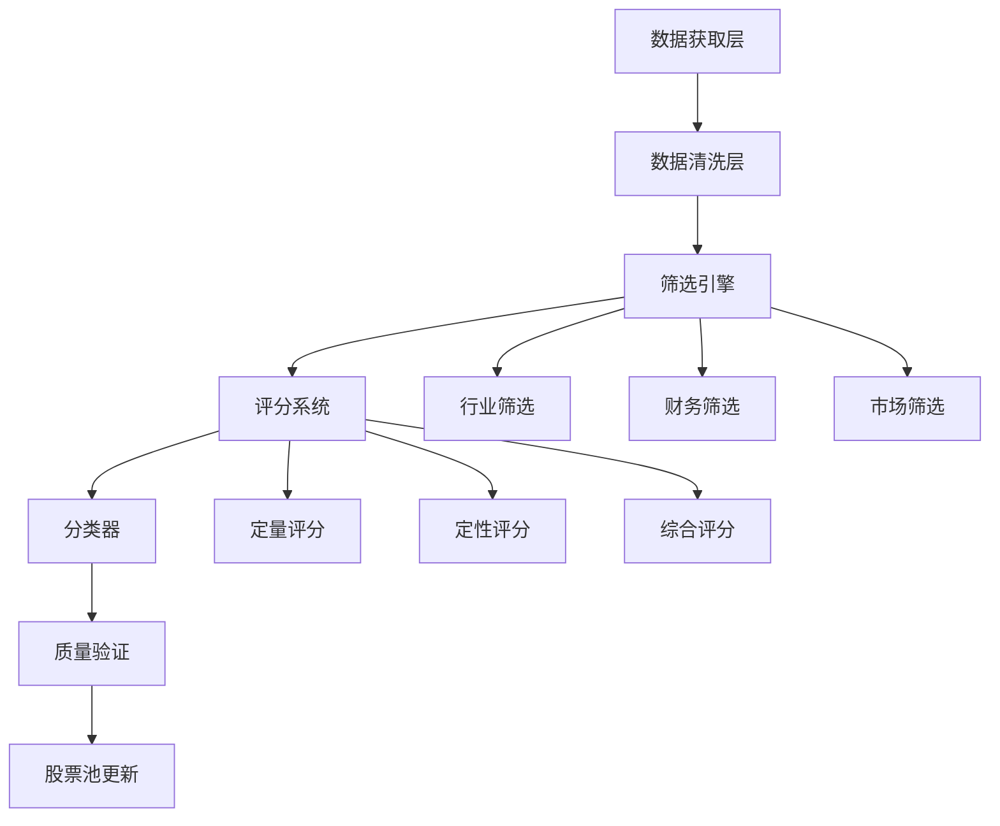

# 科技股池扩充设计文档

## 设计概述

本设计文档详细阐述了科技股池扩充的技术方案，包括筛选策略、评分体系、实施方案等。目标是将现有27只股票扩充至80-100只高质量的主板和中小板科技股。

## 架构设计

### 整体架构



### 核心组件

1. **数据获取引擎**: 从多个数据源获取股票基础信息
2. **筛选引擎**: 基于多维度标准筛选候选股票
3. **评分系统**: 对候选股票进行量化评分
4. **分类器**: 将股票分配到合适的科技细分行业
5. **质量验证器**: 验证筛选结果的质量和合理性

## 筛选策略设计

### 第一层：行业筛选

#### 科技行业定义扩展

基于申万行业分类和业务特征，扩展科技行业覆盖面：

1. **半导体产业链**
   - 芯片设计、制造、封测
   - 半导体设备、材料
   - 功率器件、模拟芯片

2. **人工智能与大数据**
   - AI算法、机器学习
   - 数据处理、云计算
   - 智能语音、计算机视觉

3. **5G与通信技术**
   - 通信设备、基站建设
   - 光通信、射频器件
   - 网络安全、物联网

4. **新能源科技**
   - 锂电池、储能技术
   - 光伏设备、风电设备
   - 新能源汽车产业链

5. **消费电子与智能硬件**
   - 智能手机产业链
   - 可穿戴设备、智能家居
   - 电子元器件、精密制造

6. **软件与信息服务**
   - 企业软件、行业解决方案
   - 互联网服务、电商平台
   - 金融科技、教育科技

7. **生物医药科技**
   - 医疗器械、体外诊断
   - 生物制药、基因技术
   - 数字医疗、远程医疗

8. **智能制造与工业互联网**
   - 工业自动化、机器人
   - 工业软件、MES系统
   - 3D打印、激光设备

#### 行业筛选标准

```python
INDUSTRY_KEYWORDS = {
    "半导体": ["芯片", "集成电路", "半导体", "晶圆", "封测"],
    "人工智能": ["人工智能", "AI", "机器学习", "深度学习", "算法"],
    "5G通信": ["5G", "通信", "基站", "光通信", "射频"],
    "新能源": ["锂电池", "储能", "光伏", "风电", "新能源"],
    "消费电子": ["智能手机", "可穿戴", "电子元器件", "精密制造"],
    "软件服务": ["软件", "云计算", "大数据", "互联网", "SaaS"],
    "生物医药": ["医疗器械", "体外诊断", "生物制药", "基因"],
    "智能制造": ["工业自动化", "机器人", "工业软件", "3D打印"]
}
```

### 第二层：财务健康度筛选

#### 基础财务指标

1. **盈利能力指标**
   - ROE（净资产收益率）≥ 8%
   - ROA（总资产收益率）≥ 4%
   - 毛利率 ≥ 20%
   - 净利率 ≥ 5%

2. **成长性指标**
   - 近3年营收复合增长率 ≥ 10%
   - 近3年净利润复合增长率 ≥ 15%
   - 研发投入占营收比例 ≥ 3%

3. **财务稳健性指标**
   - 资产负债率 ≤ 60%
   - 流动比率 ≥ 1.2
   - 速动比率 ≥ 0.8
   - 现金流量比率 ≥ 0.1

4. **估值合理性指标**
   - PE（市盈率）≤ 50倍
   - PB（市净率）≤ 8倍
   - PEG（市盈增长比）≤ 2.0

### 第三层：市场表现筛选

#### 流动性指标

1. **市值要求**
   - 总市值 ≥ 50亿元
   - 流通市值 ≥ 30亿元

2. **交易活跃度**
   - 日均成交额 ≥ 5000万元
   - 换手率 ≥ 0.5%
   - 年交易天数比例 ≥ 80%

3. **价格稳定性**
   - 年波动率 ≤ 60%
   - 最大回撤 ≤ 50%
   - 涨停跌停频率 ≤ 10%

### 第四层：定性筛选标准

#### 竞争优势评估

1. **技术护城河**
   - 核心技术专利数量
   - 技术壁垒高度
   - 研发团队实力

2. **市场地位**
   - 行业排名前5
   - 市场份额 ≥ 10%
   - 客户粘性强

3. **管理质量**
   - 管理团队稳定性
   - 公司治理结构
   - 信息披露质量

## 评分体系设计

### 综合评分模型

```python
class TechStockScreeningScore:
    def __init__(self):
        self.weights = {
            'financial_health': 0.35,    # 财务健康度
            'growth_potential': 0.25,    # 成长潜力
            'market_performance': 0.20,  # 市场表现
            'competitive_advantage': 0.20 # 竞争优势
        }
    
    def calculate_score(self, stock_data):
        scores = {
            'financial_health': self.financial_score(stock_data),
            'growth_potential': self.growth_score(stock_data),
            'market_performance': self.market_score(stock_data),
            'competitive_advantage': self.competitive_score(stock_data)
        }
        
        total_score = sum(
            scores[key] * self.weights[key] 
            for key in scores
        )
        
        return total_score, scores
```

### 财务健康度评分（35%权重）

```python
def financial_score(self, data):
    """财务健康度评分"""
    score = 0
    
    # ROE评分 (25%)
    roe = data.get('roe', 0)
    if roe >= 15:
        roe_score = 100
    elif roe >= 10:
        roe_score = 80
    elif roe >= 8:
        roe_score = 60
    else:
        roe_score = max(0, roe * 5)
    
    # 负债率评分 (20%)
    debt_ratio = data.get('debt_ratio', 100)
    if debt_ratio <= 30:
        debt_score = 100
    elif debt_ratio <= 50:
        debt_score = 80
    elif debt_ratio <= 60:
        debt_score = 60
    else:
        debt_score = max(0, 100 - debt_ratio)
    
    # 现金流评分 (25%)
    cash_flow_ratio = data.get('cash_flow_ratio', 0)
    cash_score = min(100, cash_flow_ratio * 500)
    
    # 盈利稳定性评分 (30%)
    profit_stability = data.get('profit_stability', 0)
    stability_score = min(100, profit_stability * 100)
    
    score = (roe_score * 0.25 + debt_score * 0.20 + 
             cash_score * 0.25 + stability_score * 0.30)
    
    return score
```

### 成长潜力评分（25%权重）

```python
def growth_score(self, data):
    """成长潜力评分"""
    # 营收增长率评分 (40%)
    revenue_growth = data.get('revenue_growth_3y', 0)
    if revenue_growth >= 30:
        revenue_score = 100
    elif revenue_growth >= 20:
        revenue_score = 80
    elif revenue_growth >= 10:
        revenue_score = 60
    else:
        revenue_score = max(0, revenue_growth * 3)
    
    # 净利润增长率评分 (40%)
    profit_growth = data.get('profit_growth_3y', 0)
    if profit_growth >= 40:
        profit_score = 100
    elif profit_growth >= 25:
        profit_score = 80
    elif profit_growth >= 15:
        profit_score = 60
    else:
        profit_score = max(0, profit_growth * 2)
    
    # 研发投入评分 (20%)
    rd_ratio = data.get('rd_ratio', 0)
    if rd_ratio >= 8:
        rd_score = 100
    elif rd_ratio >= 5:
        rd_score = 80
    elif rd_ratio >= 3:
        rd_score = 60
    else:
        rd_score = rd_ratio * 20
    
    score = (revenue_score * 0.4 + profit_score * 0.4 + rd_score * 0.2)
    return score
```

## 实施方案

### 数据获取策略

1. **主要数据源**
   - akshare: 基础行情和财务数据
   - 东方财富: 行业分类和概念标签
   - 同花顺: 研发投入和专利数据

2. **数据更新频率**
   - 基础信息: 每日更新
   - 财务数据: 季度更新
   - 行业分类: 半年更新

### 筛选流程

```python
class TechStockPoolExpansion:
    def __init__(self):
        self.current_pool = get_tech_stock_pool()
        self.candidate_stocks = []
        self.scoring_system = TechStockScreeningScore()
    
    def expand_pool(self):
        """扩充股票池主流程"""
        # 1. 获取候选股票
        candidates = self.get_candidate_stocks()
        
        # 2. 行业筛选
        tech_candidates = self.industry_screening(candidates)
        
        # 3. 财务筛选
        qualified_candidates = self.financial_screening(tech_candidates)
        
        # 4. 市场表现筛选
        liquid_candidates = self.market_screening(qualified_candidates)
        
        # 5. 综合评分
        scored_candidates = self.comprehensive_scoring(liquid_candidates)
        
        # 6. 质量验证
        verified_candidates = self.quality_verification(scored_candidates)
        
        # 7. 更新股票池
        self.update_stock_pool(verified_candidates)
        
        return verified_candidates
```

### 质量控制机制

1. **数据验证**
   - 数据完整性检查
   - 异常值检测和处理
   - 多源数据交叉验证

2. **结果验证**
   - 行业专家审核
   - 历史回测验证
   - 风险指标监控

3. **动态调整**
   - 定期重新评估
   - 市场环境适应性调整
   - 用户反馈整合

## 风险控制

### 风险识别

1. **数据风险**: 数据源不稳定、数据质量问题
2. **模型风险**: 筛选模型存在偏差或过拟合
3. **市场风险**: 市场环境变化影响筛选效果
4. **流动性风险**: 部分股票流动性不足

### 风险缓解措施

1. **多源验证**: 使用多个数据源交叉验证
2. **定期校准**: 定期校准筛选模型和参数
3. **分散投资**: 确保行业和个股分散度
4. **动态监控**: 实时监控风险指标变化

## 预期成果

### 数量目标
- 股票池规模: 从27只扩充至80-100只
- 行业覆盖: 从6个扩展至8-10个细分行业
- 质量提升: 平均评分不低于现有股票

### 质量目标
- 财务健康度: 平均ROE ≥ 12%
- 成长性: 平均营收增长率 ≥ 15%
- 流动性: 平均日成交额 ≥ 1亿元
- 估值合理性: 平均PE ≤ 35倍

### 风险控制目标
- 单一行业权重 ≤ 25%
- 单只股票权重 ≤ 5%
- 整体波动率 ≤ 30%
- 最大回撤 ≤ 25%

## 后续优化方向

1. **机器学习增强**: 引入机器学习算法优化筛选效果
2. **实时监控**: 建立实时风险监控和预警系统
3. **智能调仓**: 基于市场变化智能调整股票池
4. **用户定制**: 支持用户自定义筛选标准和权重